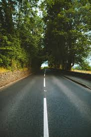
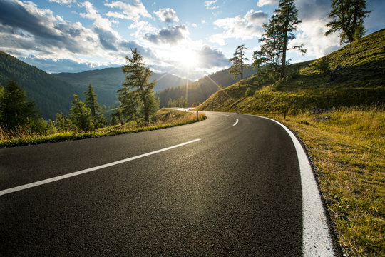

# Prompt 1

If you were a driver steering a vehicle and the road ahead looked like the image attached, how would you be steering the vehicle: 1. straight ahead 2. slightly left 3. slightly right

## Claude Sonnet 3.5
https://claude.ai/chat/b6b362f9-3c7c-4f64-a65d-46177a75b5f6

Looking at the image, I would steer slightly right (#3). The road appears to curve gently to the right ahead, as indicated by the white center line and the way the tree canopy frames the path ahead. The road seems to be a scenic route with a tunnel-like effect created by overhanging trees, and the slight right curve is visible in how the road alignment and tree coverage progress into the distance.

When driving on such roads, it's important to:
- Maintain moderate speed due to the limited visibility ahead
- Stay alert for potential obstacles or wildlife that might emerge
- Be aware that the road surface might be damp or have fallen leaves in shaded areas like this

## Gemini 2.0 Flash Experimental
https://gemini.google.com/app/c4bfa8d9c730be5e

Based on the image, the road appears to curve slightly to the right as it goes into the tree-covered section. Therefore, I would be steering **3. slightly right**.

It's important to:

*   **Follow the road's natural path:** The white line in the center of the road also angles slightly to the right, indicating the direction of the road.
*   **Maintain a safe position within the lane:** Even though it's a slight curve, gentle steering input is needed to stay centered in the lane.
*   **Be prepared to adjust:** Road conditions can change, so it's always important to be attentive and ready to adjust your steering as needed.

Disclaimer: I am an AI and cannot provide actual driving advice. Always prioritize safe driving practices and follow local traffic laws.

## ChaGPT 4o
https://chatgpt.com/c/67869da8-5b70-800f-9b0f-c0ad29b58008

Based on the image you uploaded, the road ahead appears straight. As a driver steering the vehicle, you would likely keep the steering wheel steady and drive straight ahead. However, ensure you're attentive to the surroundings and potential obstacles on the road.

## Grok 2
https://x.com/i/grok?conversation=1879215322072535461

## Chatbot Arena
https://lmarena.ai/

## Model A: gremlin

Based on the image, I would be steering the vehicle straight ahead (1). The road has a clear, solid white line down the center, indicating two-way traffic, and my lane appears to continue straight. There's a very slight curve far ahead, but at the point represented in the foreground of the photo, the correct action is to maintain the current course.

## Model B: llama-3.2-vision-90b-instruct

To navigate the road ahead, you would need to steer the vehicle slightly right.

# Prompt 2

Next image:

## Claude 3.5 Sonnet 

Looking at this mountain road image, as a driver I would steer slightly left (#2). The road curves to the left around the mountainside, as clearly shown by the white road marking and the curvature of the asphalt. 

The scene shows:
- A sharp left bend on a mountain road
- Beautiful golden hour lighting with sun rays breaking through clouds
- Alpine/mountain terrain with evergreen trees
- A well-maintained road surface with clear white line marking
- A steep drop-off on the left side of the road

For safety on such mountain roads, drivers should:
- Reduce speed before entering the curve
- Stay well away from the edge due to the steep drop-off
- Be prepared for oncoming traffic around the blind curve
- Watch for potential loose gravel or wildlife, especially during sunrise/sunset hours as shown

## Gemini 2.0 Flash Experimental

In this image, the road clearly curves to the right. Therefore, a driver would need to steer **3. slightly right**, and then progressively increase the steering input as the curve tightens.

Here's a more detailed breakdown:

*   **Initial Steering:** As the road begins to curve, a gentle rightward steering input is required.
*   **Progressive Steering:** The curve becomes sharper as it progresses into the image. This means the driver would need to gradually increase the amount of rightward steering to maintain the correct path within the lane.
*   **Maintaining Lane Position:** The white line on the left edge of the road provides a visual guide for maintaining proper lane position throughout the curve.
*   **Look Ahead:** A good driving practice is to look through the curve, not just at the road immediately in front of the vehicle. This helps anticipate the path of the road and allows for smoother steering adjustments.

Again, it's important to remember that I'm an AI and cannot provide real-world driving instructions. This analysis is based solely on the visual information in the image. Always prioritize safe driving practices and adhere to traffic laws.

## ChatGPT 4o

In this image, the road ahead curves to the right. As a driver steering the vehicle, you would need to steer slightly to the right to follow the curve of the road. Make sure to adjust the steering gradually and maintain control of the vehicle while navigating the curve.

## Grok 2

In this image, the road curves to the right as it ascends a hill. If I were steering a vehicle here, I would choose option 3. slightly right to follow the curve of the road. The road's path is clear, and following the curve ensures I stay within the lane and safely navigate the turn. The surrounding scenery suggests a scenic drive, so maintaining control by following the road's natural curve is crucial.

## Chatbot Arena

## Model A: anonymous-chatbot

Based on the image, the road curves gently to the right. As a driver, you would steer the vehicle slightly right to follow the curve of the road.

## Model B: step-1o-vision-32k-highres

Based on the image, the road is curving to the left. To stay on the right side of the road, you would need to steer:

2. slightly left

